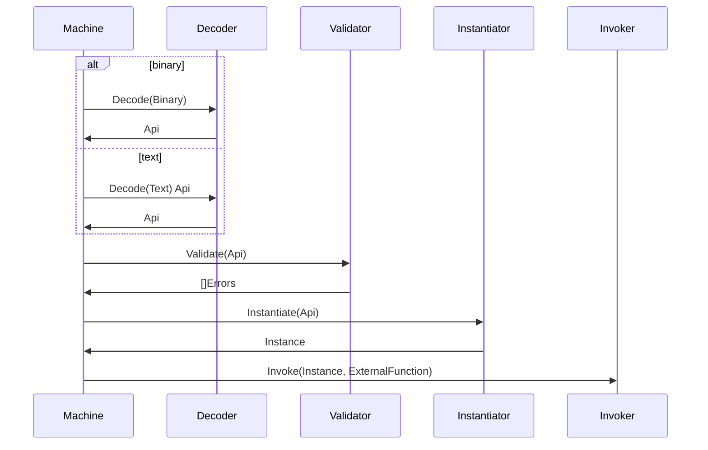
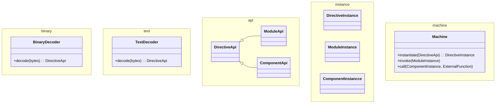

# go-wasm
experiments with wasm

# Phases

```mermaid
sequenceDiagram    
    alt binary
        Machine->>Decoder: Decode(Binary)
        Decoder->>Machine: Api
    else text
        Machine->>Decoder: Decode(Text) Api
        Decoder->>Machine: Api
    end
    Machine->>Validator: Validate(Api)
    Validator->>Machine: []Errors
    Machine->>Instantiator: Instantiate(Api)
    Instantiator->>Machine: Instance
    Machine->>Invoker: Invoke(Instance, ExternalFunction)
```

# Structure

```mermaid
classDiagram
    
    DirectiveApi<|--ModuleApi
    DirectiveApi<|--ComponentApi

    namespace binary{
        class BinaryDecoder{
            +decode(bytes) : DirectiveApi
        }        
    }
    namespace text{
        class TextDecoder{
            +decode(bytes) : DirectiveApi
        }   
    }
    namespace api{
        class DirectiveApi
        class ModuleApi
        class ComponentApi
    }
    namespace instance{
        class DirectiveInstance
        class ModuleInstance
        class ComponentInstancce
    }
    namespace machine{
        class Machine{
            +instantiate(DirectiveApi) : DirectiveInstance
            +invoke(ModuleInstance)
            +call(ComponentInstance, ExternalFunction)
        }
    }
```